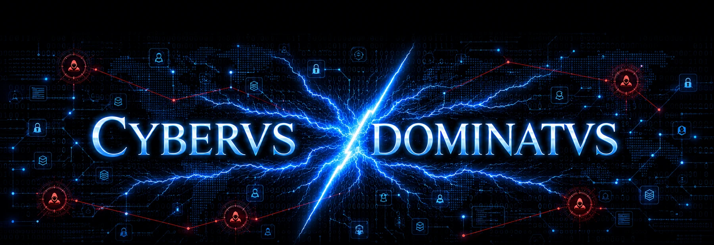

# CYBERVS DOMINATVS X LISTENING STATION

**by GhostExodus · v3.4.1**

This is a Twitter/X scraper for SOCMINT/OSINT and intelligence with an easy to navigate GUI, no API required. Designed for monitoring X accounts, building historical archives over time, mapping follower networks, scraping replies, posts, retweets, and 3rd-party posts, detecting common connections, highlighting intelligence indicators, preserving evidence, and managing multi-campaign investigations. Comes with a built-in dedicated Chromium browser. Login to your X/Twitter account, and you're connected. It's that simple.

*** DO NOT USE YOUR OWN TWITTER/X ACCOUNT. USE AN ALTERNATE ACCOUNT ***

MAJOR DEPENDENCY: The app requires Node.js in order to build/package/compile the app. You can download Node.js from the official site here: https://nodejs.org/en/download

To begin, add a username to monitor in the Target Sources section:


Example showing relationship tree between entities


Keywork/phrase search by creating keyword presets to scan posts and replies.


Export findings to .json or .pdf 


Automatically log any changes so you you can track updates made by X Listener


### v3.4.1 avatar repair
This release corrects a v3.4.0 profile-avatar selector that could capture the signed-in X account avatar instead of the monitored target avatar. On first launch after upgrading, the application invalidates the affected local avatar cache, recovers independently observed avatar URLs where available, and performs a one-time live refresh of monitored target profile images. Existing collected records are preserved.



An Electron + React + TypeScript desktop OSINT/SOCMINT workstation for campaign-scoped X monitoring, local evidence preservation, network analysis, longitudinal change tracking, analyst reporting, integrated Tor routing, and selective image evidence collection.

## Enterprise v3 highlights

### Collection command board
Each monitored source receives a collection-health view showing local post/network counts, oldest archived post, the latest collection run, records observed versus newly added, duplicate pressure, completed depth, stop reason, and errors. A network operation that observes records but repeatedly adds nothing is surfaced as a plateau instead of failing silently.

### Redesigned follower/following collector
X uses virtualized lists: rows that have scrolled off-screen can disappear from the DOM. Enterprise v3 installs an in-page `MutationObserver` accumulator before scrolling. Every `UserCell` encountered during that scan is retained in memory even after X removes the corresponding DOM node. The app then deduplicates those identities against the local campaign archive.

Incremental archive cycles continue increasing network depth over time, up to the configured maximum. Collection runs record frontier usernames, pass depth, observed/new/duplicate counts, stable-end detection, and errors.

### Automatic common-network intelligence
Follower Network automatically recomputes relationships whenever campaign data changes:

- Pairwise common followers.
- Pairwise common following.
- Combined common identities.
- Multi-target intersections.
- Per-identity target coverage.
- Network-overlap/relevance score.
- Clickable common identities that open their real X profile.
- Interactive relationship graph for the highest-overlap identities.

A high overlap score is a structural signal only. It is not an assertion that an account is important, coordinated, or involved in wrongdoing.

### Network change observations
Network snapshots record newly observed identities. When two scans are sufficiently comparable, identities absent from the later scan are marked **NOT SEEN IN LATEST COMPARABLE SCAN**. They are deliberately not called “unfollowed,” because X may reorder, truncate, or withhold list content.

### Campaign workspaces
Campaigns are the top-level workspace. Create separate campaigns for threat intelligence, news monitoring, safeguarding, research, or any other user-defined purpose. Profiles, findings, follower/following records, notes, presets, entities, change events, network analysis, collection telemetry, archive settings, and image-collection settings are scoped to the active campaign. Campaigns can be created, edited, deleted, switched, or duplicated from the top of the left navigation.

### Entity index
Findings are automatically indexed for useful text entities including:

- X mentions
- Hashtags
- URLs and domains
- Email addresses
- Phone-like strings
- Ethereum/Bitcoin-like addresses
- Organization-like names based on common organization suffixes

The Entity Index shows occurrence counts, source accounts, and first/last observation timestamps. X mentions are clickable.

### Historical change intelligence
The application retains profile metadata snapshots and can record changes to display name, biography, avatar, location, and website. Findings maintain first/last observation, evidence hashes, availability state, live-verification time, and text version history when a live re-check discovers changed text.

### Evidence provenance
Locally retained findings and relationship records carry observation timestamps and SHA-256 evidence hashes. JSON/PDF/CSV export paths generate `.sha256.txt` sidecars so an exported file can later be integrity-checked.

## Existing capabilities retained

- Dedicated persistent authenticated X browser session.
- Multiple monitored X sources.
- Original posts, replies, reposts, and configurable third-party comment collection.
- Live local feed and authenticated real-thread/profile opening.
- Search-integrated keyword/phrase presets with ANY/ALL matching, add/edit/delete controls, and highlighted matches.
- Persistent investigative notes.
- Followers/following extraction and searchable clickable entities.
- Sequential automatic sweeps.
- Incremental older-post and network archiving.
- JSON/PDF finding reports and JSON/CSV network exports.
- One-click campaign/per-target image evidence collection with SHA-256 metadata.
- Persistent Connect over Tor / Disconnect over Tor control with verified status.
- Local persistence and deduplication.

## First run

Extract the complete ZIP into a new folder. For development mode, open PowerShell in that folder and run:

```powershell
pnpm install --frozen-lockfile
pnpm run dev
```

The development launcher runs page-injection, enterprise-logic, and v3.1 campaign/Tor/media regression checks before starting Electron.

## Connect X

1. Open **SYSTEM**.
2. Select **CONNECT / REOPEN X**.
3. Sign in in the dedicated X window.
4. Close the X window after the session is signed in.
5. Add sources under **TARGET SOURCES**.

The authenticated Chromium session remains in Electron's isolated `persist:x-listening-station` partition. Node integration is disabled in remote X pages, context isolation and sandboxing are enabled, and the React renderer cannot directly read X cookies.

## Tor routing

The compiled Windows application now includes its own Tor runtime. Click the persistent bottom-left **CONNECT OVER TOR** control and X Listening Station starts the bundled Tor client automatically, selects a private local SOCKS port, keeps X traffic fail-closed while Tor bootstraps, and turns the indicator green only after the Tor Project exit check succeeds. No separate Tor Browser installation is required. If the bundled runtime cannot start, an already-running verified Tor service on `9050` or `9150` can still be used as a fallback.

The build helper downloads the official Tor Expert Bundle from the Tor Project and verifies its published SHA-256 before packaging it. The Tor route applies to the authenticated X partition and its media/network requests. A logged-in X account is still identifiable as that account; Tor routing is not equivalent to anonymity.

## Network settings

**SYSTEM → NETWORK SETTINGS** selects how X traffic is routed while the routing control is connected:

- **Integrated Tor (default).** The bundled Tor Expert Bundle described above, started and verified automatically.
- **Tor at an IP and port.** Route through a Tor client you operate yourself — a local daemon, Tor Browser's SOCKS port, or a Tor client on another machine — by entering its SOCKS5 host and port. The indicator shows CONNECTED OVER TOR only after the Tor Project exit check succeeds through that endpoint.

Either mode stays fail-closed inside the application: X traffic is blocked until the selected route verifies, and the X partition's proxy has no direct-connection fallback.

### Using a plain SOCKS5 proxy instead of Tor

The external option also accepts a basic SOCKS5 proxy that is not Tor. If you are already on a VPN and are comfortable with your ability to run a proxy in a fail-closed fashion, this is a reasonable alternative: the application still forces all X traffic through the proxy and still blocks X traffic while the route is unverified, but the route is labeled **SOCKS5 ROUTE (NOT TOR)** because it carries only your VPN's protections, not Tor's. The fail-closed responsibility outside the application is yours — if your proxy or VPN silently falls back to a direct connection when the tunnel drops, the application cannot detect that from inside the SOCKS5 route.

## Image evidence collection

Use the always-visible **IMAGES: ON/OFF** command-bar button for the active campaign. Individual Target Sources also expose their own image toggle. When enabled, visible post images are archived locally with source URL, collection timestamp, content type, byte size, and SHA-256 hash. Turning image collection off stops new image downloads but does not delete previously archived evidence.

## Search highlight presets

Search now contains the preset editor directly. Create, edit, delete, enable, disable, or re-run any number of keyword/phrase presets. Matched phrases are highlighted in the search results and each finding shows the names of presets that matched it. Presets remain campaign-specific.

## Incremental archive

Under **SYSTEM → Incremental Archive** you can enable rotating background archive operations and configure:

- Archive interval.
- Additional post depth per cycle.
- Maximum historical post depth.
- Followers archival.
- Following archival.
- Additional network depth per cycle.
- Maximum network depth.
- Network stagnation threshold.

The archive operates only while the application is open. It does not bypass verification challenges, temporary restrictions, or unavailable content.

## Build the Windows installer

Double-click:

```text
INSTALL_WINDOWS.bat
```

This single helper also prepares and verifies the integrated Tor runtime before building the installer. Or run:

```powershell
pnpm run dist:win
```

Output:

```text
release\CYBERVS-DOMINATVS-X-Listening-Station-Enterprise-Setup-3.4.1-x64.exe
```

The generated installer is unsigned unless you configure your own Windows code-signing certificate.

## Validation commands

```powershell
pnpm run validate:page-scripts
pnpm run test:enterprise
pnpm run test:v3.1
pnpm run typecheck
pnpm run check
```

`validate:page-scripts` is specifically intended to catch broken escaping inside Electron `executeJavaScript()` page collectors before launch/build.

## Data continuity

Enterprise v3 deliberately retains the existing X Listening Station application-data location so earlier targets, findings, notes, presets, archive progress, and the authenticated X partition can migrate into the default campaign. Back up important campaign data before major upgrades.

## Collection limitations

X controls what its web interface renders. No browser collector can guarantee a complete historical profile, complete conversation, or complete follower/following list. Counts and “not seen” events should therefore be treated as observations from the material rendered during a particular collection run, not as authoritative statements about X's full internal dataset.

## License

MIT. See `LICENSE`.


## v3.3.0 distribution cleanup

The Windows source package now exposes only one root batch file: `INSTALL_WINDOWS.bat`. Development mode is started from PowerShell with `pnpm run dev`. The packaged Electron entry point is again `electron/main.cjs`, and startup diagnostics remain inside the main process. `INSTALL_WINDOWS.bat` performs dependency installation, validation, Vite production build, and standard NSIS packaging in one flow.
